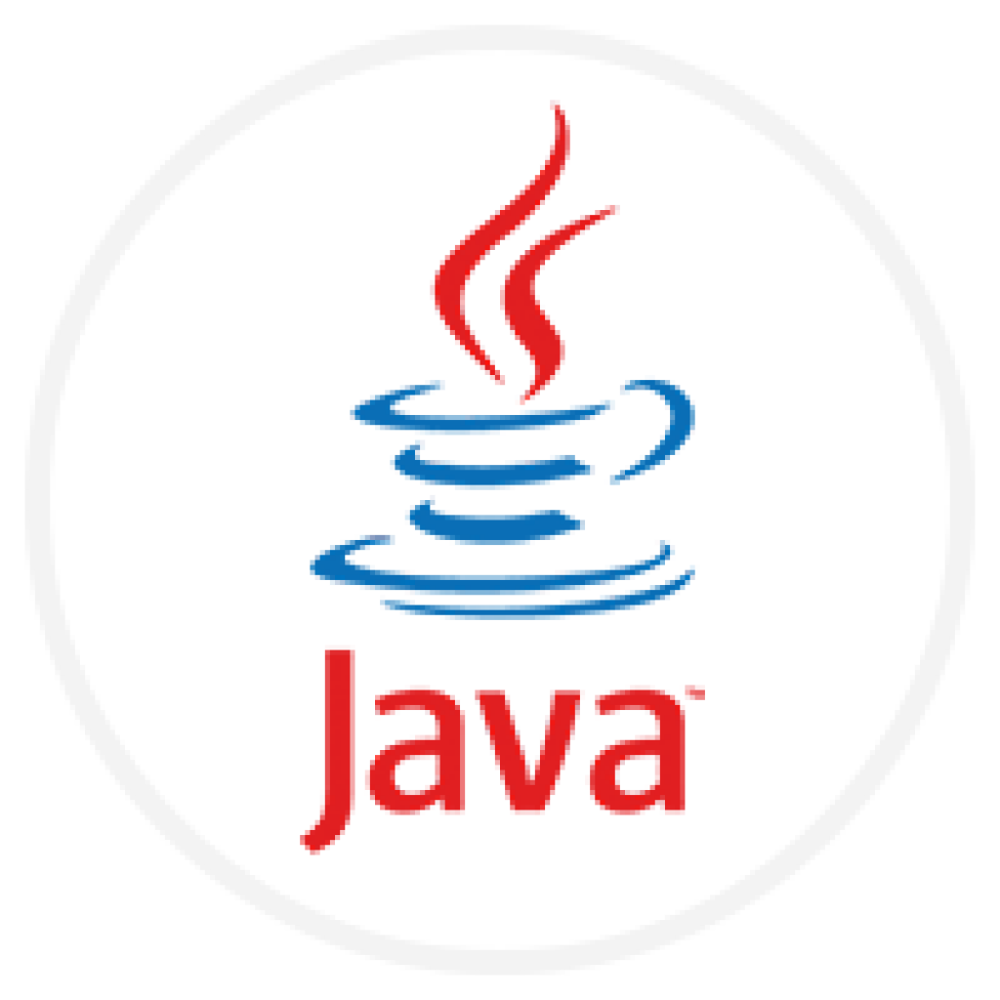

# Hi, I am TheUnixDemon

### ABOUT ME

Hello, I'm TheUnixDaemon! For now I learing something about information technology at the BBS-ME. 
I have a great interest in the system administration and the web development. I like to solving different logcial problems in these areas. I will upload my projects here, like process automation scripts and APPs.

For now I enhance my NextJS, TS, React and Docker skills.

**TOOLS:**  

**LANGUAGES:**  

**SOCIALS:**  

<!-- https://brandslogos.com/ -->
