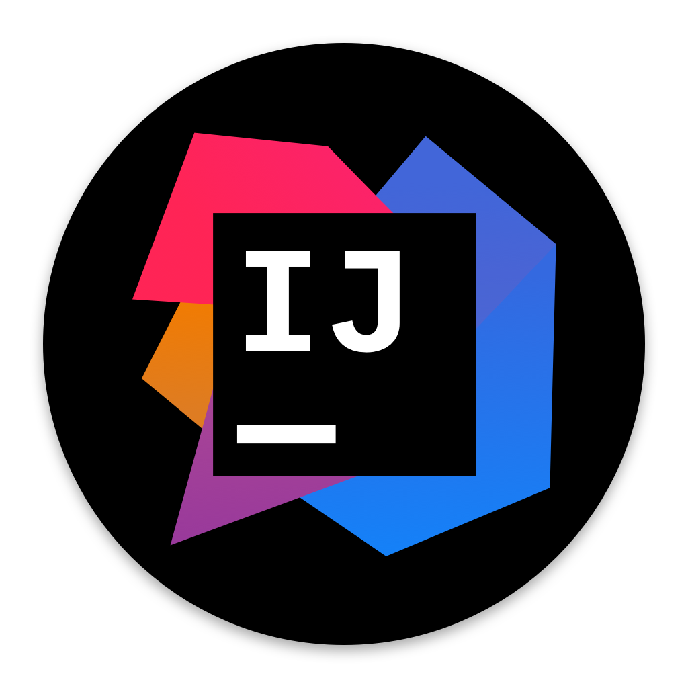

# Hi, I am TheUnixDemon

### ABOUT ME

Hello, I'm TheUnixDaemon! While my education I learned basics of computer science at the school BBS|ME. 
I have a great interest in the system administration and web/software development. I like to solving different logcial problems in these areas.  
I will upload some of my projects here, like process automation scripts and APPs.

 
For now I learn the PHP framework Laravel and the JS/TS framework NextJS.

**TOOLS:**  

**LANGUAGES:**  

**SOCIALS:**  

<!-- https://brandslogos.com/ -->
